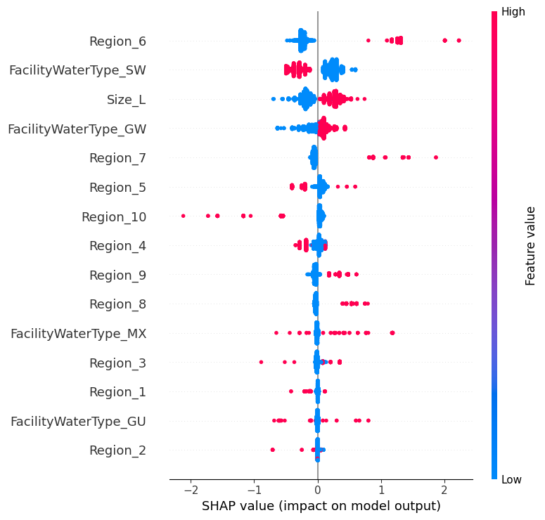
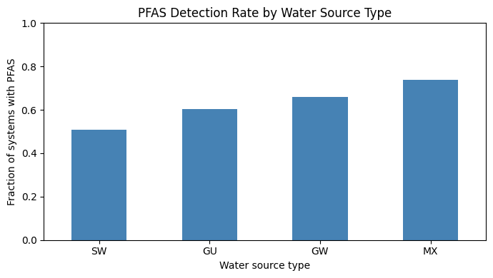
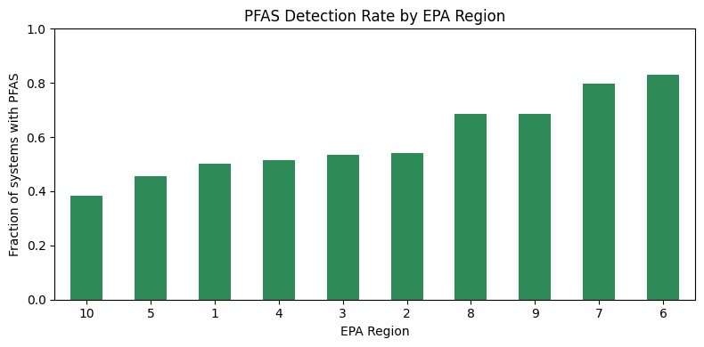
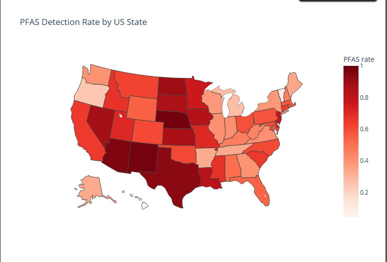

# Predicting PFAS Detection in US Drinking Water (XGBoost + SHAP)

A machine learning analysis of EPA national monitoring data, predicting whether a public water system has detectable PFAS, identifying what drives detection, and examining which specific PFAS chemicals dominate where.

## Goal

Predict whether a US public water system has detectable PFAS based on its size, location, and water source, and use SHAP to understand which factors actually drive PFAS occurrence.

## Data

EPA UCMR 5 (Fifth Unregulated Contaminant Monitoring Rule), the agency's national PFAS monitoring program covering 2023 to 2025. The raw file contains 1.93 million individual measurements across 10,299 public water systems, tested for 29 PFAS chemicals plus lithium.

## Method

1. Marked each measurement as detect or non-detect from the analytical result sign.
2. Collapsed measurements to one verdict per water system: a system counts as PFAS-detected if any of its samples, for any chemical, came back positive.
3. Checked every categorical column for invalid entries and removed 225 systems with non-state location codes (numeric codes and US territories), keeping the 50 states plus DC.
4. Built predictors from system size, state, water source type, and sampling year, one-hot encoded for modeling.
5. Trained an XGBoost classifier on an 80/20 train-test split.

### Why XGBoost

The data is tabular, a mix of categorical features like state and water type. XGBoost is the standard choice for this kind of problem because it captures non-linear relationships and interactions between features, for example, water type and system size may matter differently in combination than either does alone, something a simpler model like logistic regression cannot easily represent. It is also the current standard in applied data science for tabular classification, and it pairs naturally with SHAP, which was built with tree-based models in mind. A simpler linear model was not used as the primary model because the underlying relationship between system characteristics and PFAS detection is unlikely to be purely linear, and this was confirmed in an earlier project in this portfolio, where a random forest meaningfully outperformed logistic regression on a similar tabular classification task.
6. Used SHAP to interpret which features drive the model's predictions, and verified the key directions against raw detection rates.
7. Separately analyzed which PFAS chemicals are most frequently detected nationally and by region.

## Results

60 percent of tested water systems had detectable PFAS, a baseline that any model has to beat. The XGBoost model reached:

| Metric | Value |
|--------|-------|
| Accuracy | 0.705 |
| Baseline (always predict PFAS) | 0.60 |
| PFAS-detected recall | 0.82 |
| No-PFAS recall | 0.53 |

The model beats baseline by about 10 points, showing system size, location, and water source carry real signal about PFAS occurrence, though prediction from these characteristics alone is far from perfect.

## What Drives PFAS Detection

SHAP and direct rate comparisons agree on the main drivers:

Groundwater and mixed-source systems show higher PFAS rates (66 and 74 percent) than surface water systems (51 percent). This is consistent with PFAS being persistent compounds that accumulate in groundwater rather than flushing through surface systems.

PFAS detection varies sharply by region, from 38 percent in Region 10 (Pacific Northwest) to over 80 percent in Regions 6 and 7 (south-central and central US).

Larger water systems also show consistently higher PFAS rates than smaller ones.

## Which PFAS, and Where

Beyond whether PFAS is present, the data shows which specific chemicals dominate. Nationally, the most frequently detected are PFPeA, PFHxA, PFBS, and PFBA, with PFOS and PFOA, the two most studied PFAS, both in the top six.

The dominant chemical also varies by region: PFOA leads in the northeast, PFBA across the central US, and PFBS and PFHxS elsewhere. This suggests different regions have different contamination sources, since different PFAS are associated with different industrial and firefighting foam uses. Note that "most frequently detected" reflects how often a chemical was reported, not necessarily its concentration or health risk.

## Honest Limitations

- The model uses only four system-level characteristics. Richer predictors, such as actual population served, proximity to industrial sites, or land use, would likely improve prediction but were not available in this file.
- Findings are associations, not causes. A state or region having higher PFAS does not mean location causes contamination; it likely reflects industrial history and testing patterns.
- Adding sampling year improved accuracy by only about one point, indicating the model is close to its ceiling given the available features, the limit is the data, not the model.
- "Most frequently detected" PFAS is a count of detections, not a measure of concentration or risk.
- The lithium contaminant was initially included by mistake in an early version of the chemical analysis and was caught and excluded; UCMR 5 monitors 29 PFAS plus lithium, and lithium is not a PFAS.

## Tools

Python, pandas, XGBoost, SHAP, scikit-learn, matplotlib, plotly (Google Colab)

## Acknowledgment

This project was completed with guidance from Claude (Anthropic) for code explanation, debugging support, and technical concepts during development. All analysis decisions, data interpretation, and verification were conducted by the author.
